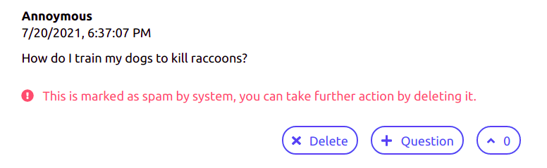

# Qask (Live Q&A app)
Qask is live Q&A app built using React and Spring Boot. 
This project highlights the use of reactive stream (with the help of [Rsocket](https://rsocket.io/)) to stream questions in real-time. 

Rsocket is designed to be an efficient counterpart of HTTP/2. It is a binary protocol that based on the reactive stream specification so that the server can maintain communications while not blocking other computations on the thread. You can read more of the benefits over [here](https://rsocket.io/about/motivations).

> ❗ Websocket is still used under the hood, make sure your browser supports it.

The entire project also fully leverages the non-blocking, Reactor API to deal with IO request in non-blocking way. It is deeply integrated with Kotlin coroutines for writing imperative (much more understandle) asynchronous code.

The webclient is written in Typesript, since the documentation on Rsocket type annotations is really lacking, hopefully this can serve as good reference to who intends to write the Rsocket client in Typescript. You can refer the type declaration in `QuestionPage.tsx`.

### **NEW** Insincere question filtering (Proof of concept)
The project also features spam filtering mechanism by using a NLP model from [here](https://www.kaggle.com/wowfattie/3rd-place). Each posted question is loaded onto a kafka queue and be batchly inferred by the model. This feature is only a proof of concept, the model can be further fine-tuned for speed and accuracy. The relevant codes reside within the `spam-filter` folder.




## Run the project
``` bash
cd frontend && yarn start

cd backend && ./gradlew bootRun

cd spam-filter && python3 infer.py
```

## Demo
Visit 127.0.0.1:3000 to create a session. Fill in session name, description and duration and you'll get presenter and audience link.

With audience link, you can post and upvote a question.

The host using the presenter link can queue a posted question and mark a question as answered
